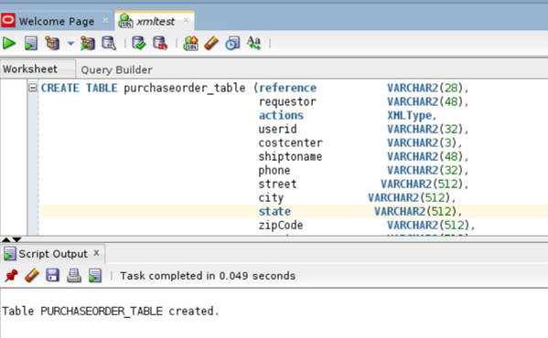
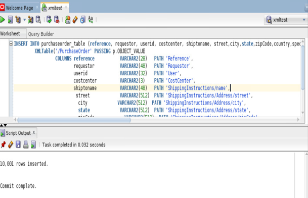
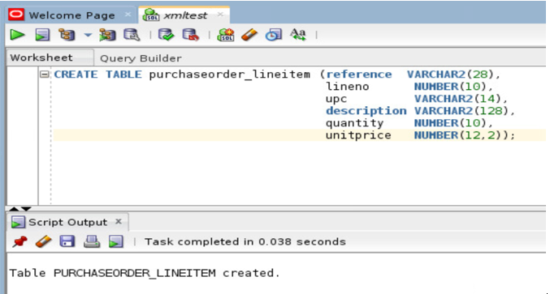
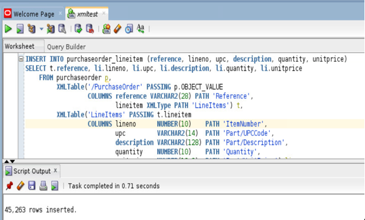
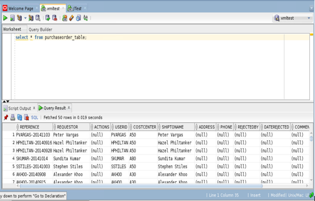
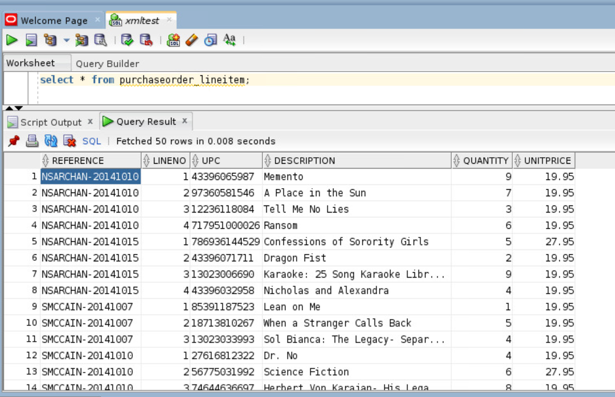
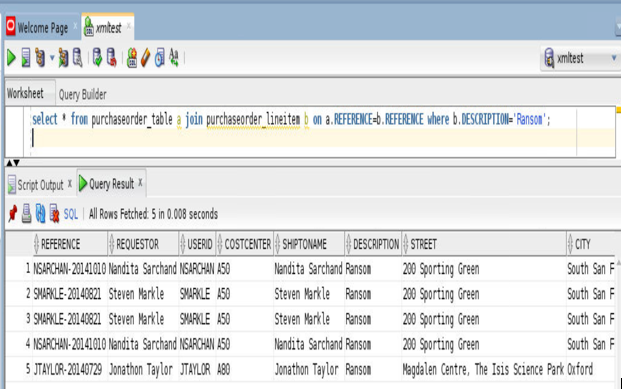
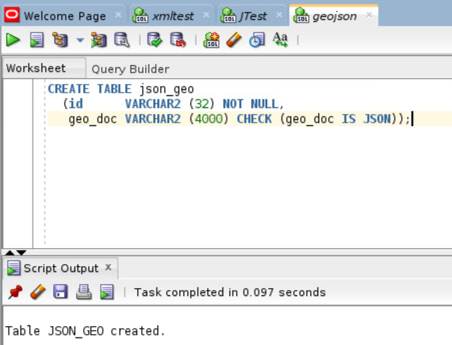
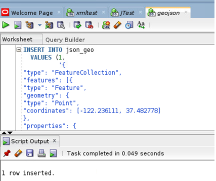
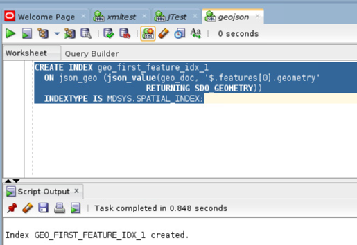

# Oracle Cross Datatype

<br>

## Json to Relational

<br>

**Scenario 1 : Product, those sold with payment mode – Cash on Delivery**

 ````
 <copy>
 select D.*
  from PURCHASE_ORDER p,
       JSON_TABLE(
         p.PO_DOCUMENT,
         '$' 
         columns(
           PO_NUMBER            NUMBER(10)                  path  '$.PONumber',
           REFERENCE            VARCHAR2(30 CHAR)           path  '$.Reference',
           REQUESTOR            VARCHAR2(32 CHAR)           path  '$.Requestor',
           USERID               VARCHAR2(10 CHAR)           path  '$.User',
           COSTCENTER           VARCHAR2(16)                path  '$.CostCenter',
		   "Special Instructions" VARCHAR2(4000) PATH '$."Special Instructions"',
           NESTED PATH '$.LineItems[*]'
           columns(
             ITEMNO         NUMBER(16)             path '$.ItemNumber', 
             DESCRIPTION    VARCHAR2(32 CHAR)      path '$.Part.Description', 
             UPCCODE        VARCHAR2(14 CHAR)      path '$.Part.UPCCode', 
             QUANTITY       NUMBER(5,4)            path '$.Quantity', 
             UNITPRICE      NUMBER(5,2)            path '$.Part.UnitPrice'
           )
         )
       ) D
where "Special Instructions"='COD'
 /
</copy>
 ````
  
 

<br>
**Scenario 2 : Purchase order history count based on City**

 

````
<copy>
select ship_to_city,count(ship_to_city) from PURCHASE_ORDER_DETAIL_VIEW group by ship_to_city;
</copy>
````
 


<br>

## Relational to XML

<br>

**XMLTABLE**: Convert XML Data into Rows and Columns using SQL. The XMLTABLE operator, which allows you to project columns on to XML data in an XMLTYPE , making it possible to query the data directly from SQL as if it were relational data.


 ````
 <copy>
CREATE TABLE purchaseorder_table (reference           VARCHAR2(28),
                                  requestor           VARCHAR2(48),
                                  userid              VARCHAR2(32),
                                  costcenter          VARCHAR2(3),
                                  shiptoname          VARCHAR2(48),
								   street             VARCHAR2(512),
								  city             VARCHAR2(512),
								  state             VARCHAR2(512),
								  zipCode             VARCHAR2(512),
								  country             VARCHAR2(512),
								  specialinstructions VARCHAR2(2048));

 </copy>
 ````
  
 


````
<copy>
INSERT INTO purchaseorder_table (reference, requestor, userid, costcenter, shiptoname, street,city,state,zipCode,country,specialinstructions)  SELECT t.reference, t.requestor, t.userid, t.costcenter, t.shiptoname, t.street, t.city,t.state,t.zipCode,t.country, t.specialinstructions    FROM purchaseorder p,
XMLTable('/PurchaseOrder' PASSING p.OBJECT_VALUE
COLUMNS reference           VARCHAR2(28)   PATH 'Reference',
requestor           VARCHAR2(48)   PATH 'Requestor',
userid              VARCHAR2(32)   PATH 'User',
costcenter          VARCHAR2(3)    PATH 'CostCenter',
shiptoname          VARCHAR2(48)   PATH 'ShippingInstructions/name',
street             VARCHAR2(512)  PATH 'ShippingInstructions/Address/street',
city             VARCHAR2(512)  PATH 'ShippingInstructions/Address/city',
state             VARCHAR2(512)  PATH 'ShippingInstructions/Address/state',
zipCode             VARCHAR2(512)  PATH 'ShippingInstructions/Address/zipCode',
country             VARCHAR2(512)  PATH 'ShippingInstructions/Address/country',
specialinstructions VARCHAR2(2048) PATH 'Special_Instructions') t;
</copy>
````
 



````
<copy>
CREATE TABLE purchaseorder_lineitem (reference  VARCHAR2(28),
                                     lineno      NUMBER(10), 
                                     upc         VARCHAR2(14),
                                     description VARCHAR2(128),
                                     quantity    NUMBER(10),
                                     unitprice   NUMBER(12,2));
</copy>
````
 


````
<copy>
 

INSERT INTO purchaseorder_lineitem (reference, lineno, upc, description, quantity, unitprice)
SELECT t.reference, li.lineno, li.upc, li.description, li.quantity, li.unitprice
    FROM purchaseorder p,
         XMLTable('/PurchaseOrder' PASSING p.OBJECT_VALUE
                  COLUMNS reference VARCHAR2(28) PATH 'Reference',
                          lineitem XMLType PATH 'LineItems') t,
         XMLTable('LineItems' PASSING t.lineitem
                  COLUMNS lineno      NUMBER(10)    PATH 'ItemNumber',
                          upc         VARCHAR2(14)  PATH 'Part/UPCCode',
                          description VARCHAR2(128) PATH 'Part/Description',
                          quantity    NUMBER(10)    PATH 'Quantity',
                          unitprice   NUMBER(12,2)  PATH 'Part/UnitPrice') li;
</copy>
````







<br>

**Scenario 3 : Customers who ordered quantity of items more than 5 and unit price is greater than $15**

````
<copy>
select * from purchaseorder_table a join purchaseorder_lineitem b on a.REFERENCE=b.REFERENCE where b.QUANTITY>5 and b.unitprice>15;
</copy>
````


<br>

**Scenario 4 : History of customers who ordered for a specific products**

````
<copy>
select * from purchaseorder_table a join purchaseorder_lineitem b on a.REFERENCE=b.REFERENCE where b.DESCRIPTION='Ransom';
</copy>
````


<br>

## JSON to Spatial

GeoJSON Objects: Geometry, Feature, Feature Collection


GeoJSON uses JSON objects that represent various geometrical entities and combinations of these together with user-defined properties.


A position is an array of two or more spatial (numerical) coordinates, the first three of which generally represent longitude, latitude, and altitude.

A geometry object has a type field and (except for a geometry-collection object) a coordinates field

A geometry collection is a geometry object with type GeometryCollection. Instead of a coordinates field it has a geometries field, whose value is an array of geometry objects other than GeometryCollection objects.



````
<copy>
CREATE TABLE json_geo
  (id      VARCHAR2 (32) NOT NULL,
   geo_doc VARCHAR2 (4000) CHECK (geo_doc IS JSON));

</copy>
````


````
<copy>
INSERT INTO json_geo
  VALUES (1,
          '{
"type": "FeatureCollection",
"features": [{
"type": "Feature",
"geometry": {
"type": "Point",
"coordinates": [-122.236111, 37.482778]
},
"properties": {
"Name": "Redwood City "
}
}, {
"type": "Feature",
"geometry": {
"type": "LineString",
"coordinates": [
[102.0, 0.0],
[103.0, 1.0],
[104.0, 0.0],
[105.0, 1.0]
]
},
"properties": {
"prop0": "value0",
"prop1": 0.0
}
},
{
"type": "Feature",
"geometry": {
"type": "Polygon",
"coordinates": [
[
[100.0, 0.0],
[101.0, 0.0],
[101.0, 1.0],
[100.0, 1.0],
[100.0, 0.0]
]
]
},
"properties": {
"prop0": "value0",
"prop1": {
"this": "that"
}
}
}
]
}');
</copy>
````


````
<copy>
CREATE INDEX geo_first_feature_idx_1
  ON json_geo (json_value(geo_doc, '$.features[0].geometry'
                       RETURNING SDO_GEOMETRY))
  INDEXTYPE IS MDSYS.SPATIAL_INDEX;
</copy>
````
<br>

**Scenario 5 : Compute the distance in KM from specific point to each Geometry**

This example selects the documents (there is only one in this table) for which the geometry field of the first features element is within 100 kilometers of a given point. The point is provided literally here (its coordinates are the longitude and latitude of San Francisco, California). The distance is computed from this point to each geometry object.

The query orders the selected documents by the calculated distance. The tolerance in meters for the distance calculation is provided in this query as the literal argument 100.


````
<copy>
  SELECT id,
 json_value(geo_doc, '$.features[0].properties.Name') "Name",
 SDO_GEOM.sdo_distance(
 json_value(geo_doc, '$.features[0].geometry' RETURNING
SDO_GEOMETRY),
 SDO_GEOMETRY(2001,
 4326,
 SDO_POINT_TYPE(-122.416667, 37.783333, NULL),
 NULL,
 NULL),
 100, -- Tolerance in meters
 'unit=KM') "Distance in kilometers"
 FROM j_geo
 WHERE sdo_within_distance(
 json_value(geo_doc, '$.features[0].geometry' RETURNING
SDO_GEOMETRY),
 SDO_GEOMETRY(2001,
 4326,
 SDO_POINT_TYPE(-122.416667, 37.783333, NULL),
 NULL,
 NULL),
 'distance=100 unit=KM')
 = 'TRUE';
</copy>
````


